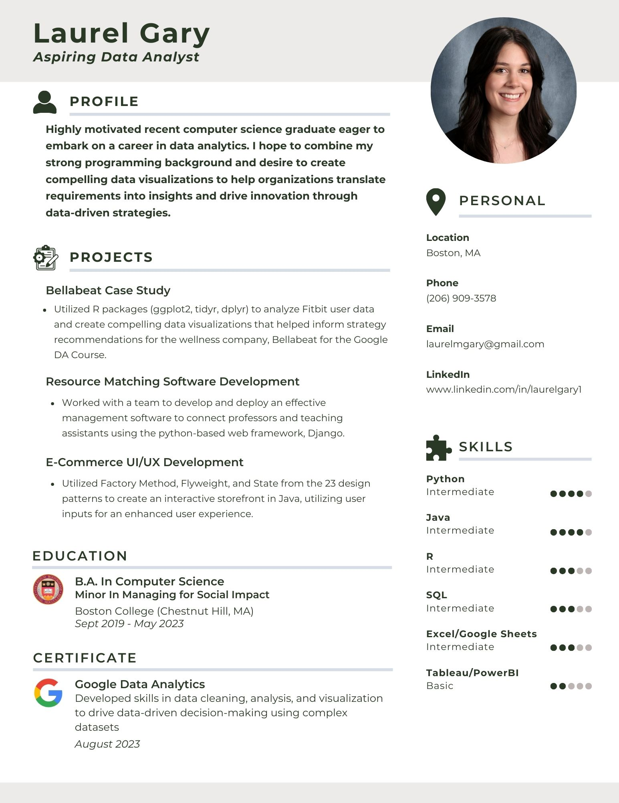

### Hi there 👋
I'm a recent CS graduate from Boston College, eager to apply my skills, knowledge, and passion across a spectrum of industries, particularly as a data analyst or software engineer. Here are some of my projects and some more information below:

[PDF Infographic](https://github.com/lmg206/lmg206/files/12908652/Gary_infographic.pdf)

<!--
**lmg206/lmg206** is a ✨ _special_ ✨ repository because its `README.md` (this file) appears on your GitHub profile.

Here are some ideas to get you started:

- 🔭 I’m currently working on ...
- 🌱 I’m currently learning ...
- 👯 I’m looking to collaborate on ...
- 🤔 I’m looking for help with ...
- 💬 Ask me about ...
- 📫 How to reach me: ...
- 😄 Pronouns: ...
- ⚡ Fun fact: ...
-->
